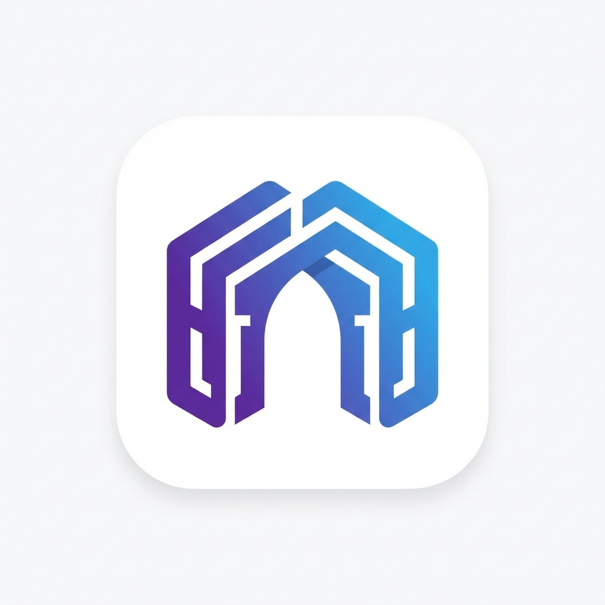

# Riwaq Arch

<div align="center">



**AI-Powered Codebase Documentation & Architecture Analysis**

[](LICENSE)
[](https://www.rust-lang.org/)
[](vscode-extension/)
[](jetbrains-plugin/)

*Transform your codebase into living documentation*

</div>

---

## Overview

**Riwaq Arch** is an intelligent codebase analysis and documentation platform that automatically generates comprehensive architectural documentation for your projects. By combining static code analysis with Large Language Models (LLMs), Riwaq creates living documentation that stays in sync with your codebase.

### Key Capabilities

- **Multi-Language Support**: Parse and analyze Rust, Python, JavaScript, TypeScript, and Go codebases
- **Architecture Discovery**: Automatically detect modules, services, and dependency relationships
- **LLM-Enhanced Documentation**: Generate human-readable documentation powered by AI
- **Visual Diagrams**: Create Mermaid diagrams for architecture and dependencies
- **Git Intelligence**: Analyze commit history to identify code hotspots and change patterns
- **Interactive Q&A**: Ask natural language questions about your codebase

---

## Installation

### Prerequisites

- **Rust** 1.75 or later ([Install Rust](https://rustup.rs/))
- **Git** for repository analysis
- **API Key** for LLM features (OpenRouter, Z.ai, or OpenAI-compatible)

### From Source

```bash
# Clone the repository
git clone https://github.com/YASSERRMD/riwaq-arch.git
cd riwaq-arch

# Build the CLI
cd core
cargo build --release

# Install to your PATH (optional)
cargo install --path .
```

### Binary Installation

```bash
# macOS/Linux
curl -sSL https://raw.githubusercontent.com/YASSERRMD/riwaq-arch/main/install.sh | bash

# Windows (PowerShell)
irm https://raw.githubusercontent.com/YASSERRMD/riwaq-arch/main/install.ps1 | iex
```

---

## Quick Start

### 1. Analyze Your Codebase

```bash
riwaq analyze --path /path/to/your/project
```

This scans your project and produces a comprehensive analysis including:
- File and module structure
- Function and type inventories
- Dependency graph
- Git history insights

### 2. Generate Documentation

```bash
riwaq docgen --path /path/to/your/project --output ./docs
```

Generates a complete documentation suite:
- `README.md` - Project overview with statistics
- `ARCHITECTURE_OVERVIEW.md` - System architecture with diagrams
- `MODULES.md` - Detailed module documentation
- `DEPENDENCIES.md` - Dependency analysis and risk assessment
- `API_REFERENCE.md` - Service endpoint documentation
- `adrs/` - Architecture Decision Records

### 3. Ask Questions

```bash
riwaq ask --path /path/to/your/project --question "How does authentication work?"
```

Get AI-powered answers to questions about your codebase.

### 4. Start the Server (for VS Code)

```bash
riwaq serve --host 127.0.0.1 --port 9527
```

> [!WARNING]
> **Docker vs. VS Code Extension**
> 
> While you can run the server via Docker, we **recommend running it natively** (`riwaq serve`) when using the VS Code extension.
>
> **Why?** Docker containers have different file paths than your host machine (e.g., `/data/project` vs `/Users/you/project`). The VS Code extension sends your local host paths to the server, which the Docker container won't recognize unless custom volume mapping mirrors your exact host structure.

---

## Configuration

### 🤖 LLM Setup

To use AI features, you **must** configure an LLM provider. Riwaq supports OpenRouter, OpenAI, and compatible services.

👉 **[Read the Detailed LLM Setup Guide](docs/LLM_SETUP.md)**

#### Quick Setup (Environment Variables)

```bash
# Option 1: OpenRouter (Recommended)
export RIWAQ_LLM_API_KEY="sk-or-..."

# Option 2: OpenAI
export RIWAQ_LLM_API_KEY="sk-..."
export RIWAQ_LLM_ENDPOINT="https://api.openai.com/v1"
export RIWAQ_LLM_MODEL="gpt-4-turbo"
```

### Environment Variables

| Variable | Description | Default |
|----------|-------------|---------|
| `RIWAQ_LLM_ENDPOINT` | LLM API endpoint | `https://openrouter.ai/api/v1` |
| `RIWAQ_LLM_MODEL` | LLM model to use | `glm-4` |
| `RIWAQ_LLM_API_KEY` | API key for LLM provider | - |

### Configuration File

Create `.riwaq.toml` in your project root:

```toml
# Project configuration
[project]
name = "my-project"

# Analysis settings
[analysis]
max_file_size = 10485760  # 10MB
max_commits = 500
include_tests = false

# Excluded directories
excluded_dirs = [
    "node_modules",
    "target",
    ".git",
    "dist",
    "build",
    "vendor"
]

# LLM settings
[llm]
endpoint = "https://open.routers.ai/api/v1"
model = "glm-4"
max_tokens = 4096
temperature = 0.3
timeout_secs = 120
```

---

## IDE Extensions

### VS Code Extension

The Riwaq VS Code extension provides an integrated experience directly in your editor.

#### Features

- **Architecture View**: Visual tree view of your project structure
- **Module Explorer**: Browse modules with health metrics
- **Quick Insights**: Code health, language breakdown, and statistics
- **Ask Panel**: Interactive Q&A about your codebase
- **Architecture Diagrams**: Mermaid diagram visualization

#### Installation

1. Open VS Code
2. Go to Extensions (`Ctrl+Shift+X`)
3. Search for "Riwaq Arch"
4. Click Install

Or install from source:
```bash
cd vscode-extension
npm install
npm run compile
# Press F5 to launch Extension Development Host
```

### JetBrains Plugin

The Riwaq JetBrains plugin brings the same powerful features to IntelliJ IDEA, PyCharm, WebStorm, and other JetBrains IDEs.

#### Features

- **Tool Window**: Comprehensive 4-tab interface (Modules, Ask AI, Diagram, Insights)
- **Server Management**: Built-in server process control with auto-start capability
- **Interactive Chat UI**: AI-powered Q&A with markdown rendering and file references
- **Architecture Diagrams**: Mermaid-based visualization with zoom controls
- **Code Health Metrics**: Real-time statistics on coupling, cohesion, and module quality
- **Status Bar Widget**: Visual indicator showing server status
- **Context Menu Integration**: Ask about selected code directly from the editor

#### Supported IDEs

- IntelliJ IDEA (Community & Ultimate)
- PyCharm (Community & Professional)
- WebStorm
- PhpStorm
- RubyMine
- CLion
- GoLand
- DataGrip
- Rider
- AppCode

#### Installation

**From Source:**

1. Clone the repository
2. Open the `jetbrains-plugin` directory in IntelliJ IDEA
3. Run `./gradlew buildPlugin`
4. The plugin will be built in `build/distributions/`
5. Install from: **IntelliJ IDEA → Settings → Plugins → Gear Icon → Install Plugin from Disk**

**Development:**

```bash
cd jetbrains-plugin
./gradlew buildPlugin    # Build plugin
./gradlew runIde         # Run in development IDE
./gradlew check          # Run tests and verifications
```

#### Configuration

Configure the plugin via **Settings → Tools → Riwaq Arch**:

- **Server URL**: Where the Riwaq server is running (default: `http://127.0.0.1:9527`)
- **Server Binary Path**: Optional custom path to the `riwaq` binary
- **Auto-start Server**: Automatically start server when IDE opens
- **LLM Configuration**: API key, endpoint, and model selection
- **Excluded Directories**: Directories to skip during analysis

Project-level settings are available in **Settings → Project → Riwaq Arch**:

- **Auto-analyze**: Automatically re-analyze on file changes
- **Excluded Files**: File patterns to exclude
- **Custom Prompt**: Additional instructions for AI analysis

#### Actions

Available from **Tools → Riwaq Actions**:

- **Start Riwaq Server**: Manually start the analysis server
- **Stop Riwaq Server**: Stop the running server
- **Restart Riwaq Server**: Restart the server
- **Analyze Project**: Analyze the current project
- **Ask About Codebase**: Open the AI Q&A panel
- **View Architecture Diagram**: Open the diagram visualization

#### Requirements

- IntelliJ IDEA 2023.2 or later (or compatible JetBrains IDE)
- Java 17 or later
- Riwaq server (bundled or user-provided)

---

## API Reference

When running the server (`riwaq serve`), the following REST API endpoints are available:

### Health Check
```http
GET /health
```

### Analyze Codebase
```http
POST /analyze
Content-Type: application/json

{
  "path": "/path/to/project",
  "max_commits": 500,
  "include_tests": false
}
```

### Generate Documentation
```http
POST /docgen
Content-Type: application/json

{
  "path": "/path/to/project",
  "output": "./generated-docs",
  "skip_llm": false
}
```

### Ask Question
```http
POST /ask
Content-Type: application/json

{
  "question": "How does the authentication module work?",
  "project_path": "/path/to/project"
}
```

### Get Architecture Diagram
```http
GET /architecture/diagram
```

---

## Supported Languages

| Language | File Extensions | Parser |
|----------|-----------------|--------|
| Rust | `.rs` | tree-sitter-rust |
| Python | `.py` | tree-sitter-python |
| JavaScript | `.js`, `.jsx` | tree-sitter-javascript |
| TypeScript | `.ts`, `.tsx` | tree-sitter-typescript |
| Go | `.go` | tree-sitter-go |

---

## Architecture

```
riwaq-arch/
├── core/                    # Rust core library and CLI
│   ├── src/
│   │   ├── analysis/        # Code parsing and analysis
│   │   ├── docs/            # Documentation generation
│   │   ├── llm/             # LLM client and prompts
│   │   ├── models/          # Data structures
│   │   ├── server/          # HTTP API server
│   │   └── main.rs          # CLI entry point
│   └── Cargo.toml
│
├── vscode-extension/        # VS Code extension
│   ├── src/
│   │   ├── extension.ts     # Extension entry point
│   │   ├── client.ts        # HTTP client
│   │   ├── views/           # Tree view providers
│   │   └── panels/          # Webview panels
│   └── package.json
│
├── jetbrains-plugin/        # JetBrains IDE plugin
│   ├── src/main/kotlin/
│   │   ├── actions/         # Menu actions and commands
│   │   ├── client/          # API client for server
│   │   ├── server/          # Server process management
│   │   ├── settings/        # Configuration UI
│   │   ├── statusbar/       # Status bar widget
│   │   ├── toolwindow/      # Main UI panels
│   │   └── listeners/       # Project lifecycle events
│   ├── build.gradle.kts     # Gradle build config
│   └── plugin.xml           # Plugin manifest
│
└── README.md
```

---

## Performance

Riwaq is designed for efficiency:

- **Incremental Analysis**: Only re-analyzes changed files
- **Parallel Processing**: Multi-threaded file parsing
- **Lazy LLM Calls**: LLM operations are optional and cached
- **Memory Efficient**: Streams large files instead of loading entirely

### Benchmarks

| Project Size | Files | Analysis Time | Memory |
|--------------|-------|---------------|--------|
| Small (<1K files) | 500 | ~2s | ~50MB |
| Medium (1K-10K) | 5,000 | ~15s | ~200MB |
| Large (>10K) | 20,000 | ~45s | ~500MB |

---

## Troubleshooting

### Common Issues

**LLM API Key Not Working**
```bash
# Verify your API key is set
echo $RIWAQ_LLM_API_KEY

# Test with a simple request
riwaq ask --path . --question "What is this project?"
```

**Analysis Takes Too Long**
- Reduce `max_commits` in configuration
- Add large directories to `excluded_dirs`
- Enable `--skip-llm` for faster analysis

**VS Code Extension Not Connecting**
1. Ensure server is running: `riwaq serve`
2. Check server URL in VS Code settings
3. Verify firewall allows localhost connections

**JetBrains Plugin Not Connecting**
1. Ensure server is running: Check status bar widget (should show 🟢)
2. Start server manually: **Tools → Riwaq Actions → Start Riwaq Server**
3. Check server URL in **Settings → Tools → Riwaq Arch**
4. Verify server binary path is correct
5. Check plugin logs in IDE's internal log viewer

---

## Contributing

We welcome contributions! Please see our [Contributing Guide](CONTRIBUTING.md) for details.

### Development Setup

```bash
# Clone and build
git clone https://github.com/YASSERRMD/riwaq-arch.git
cd riwaq-arch/core
cargo build

# Run tests
cargo test

# Run with debug logging
RUST_LOG=debug cargo run -- analyze --path .
```

---

## License

This project is licensed under the MIT License - see the [LICENSE](LICENSE) file for details.

---

## Acknowledgments

- [tree-sitter](https://tree-sitter.github.io/tree-sitter/) for robust code parsing
- [OpenRouter](https://openrouter.ai/) for LLM API access
- The Rust community for excellent tooling

---

<div align="center">

**Built by [YASSERRMD](https://github.com/YASSERRMD)**

[Documentation](https://github.com/YASSERRMD/riwaq-arch/wiki) | [Issues](https://github.com/YASSERRMD/riwaq-arch/issues) | [Discussions](https://github.com/YASSERRMD/riwaq-arch/discussions)

</div>
