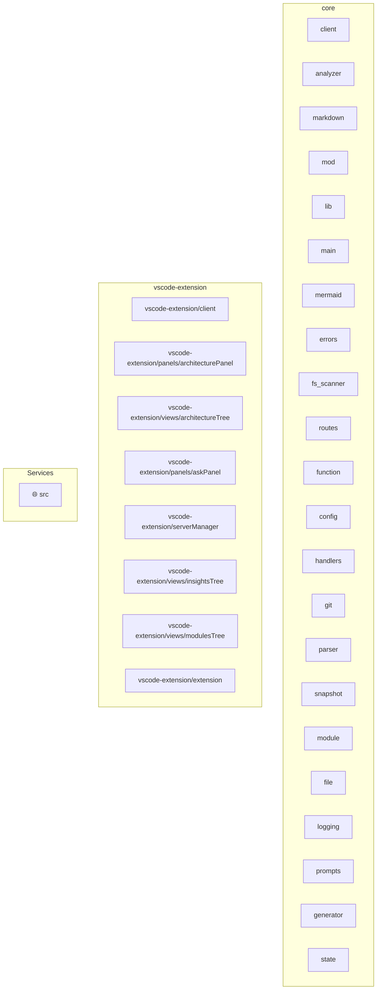

# riwaq-arch - Architecture Overview

## System Overview

This document provides an architectural overview of the riwaq-arch codebase, consisting of 35 modules across 35 files with 9525 total lines of code.

## Architecture Diagram



## Services & Entry Points

| Service | Type | Entry File |
| --- | --- | --- |
| src | HttpServer | core/src/main.rs |

## Modules

### client

**Path**: `core::llm::client`

**Files**: 1

**Public Functions**: `new`, `with_defaults`, `new`, `add_response`


### analyzer

**Path**: `core::analysis::analyzer`

**Files**: 1

**Public Functions**: `new`, `with_config`, `with_max_commits`, `with_include_tests`, `without_git`, `without_parsing`, `analyze`


### markdown

**Path**: `core::docs::markdown`

**Files**: 1

**Public Functions**: `new`, `h1`, `h2`, `h3`, `h4`, `paragraph`, `bold`, `italic`, `code_inline`, `code_block`

... and 17 more


### vscode-extension/client

**Path**: `vscode-extension/client`

**Files**: 1


### mod

**Path**: `core::models::mod`

**Files**: 1


### lib

**Path**: `core::lib`

**Files**: 1


### vscode-extension/panels/architecturePanel

**Path**: `vscode-extension/panels/architecturePanel`

**Files**: 1


### main

**Path**: `core::main`

**Files**: 1


### mod

**Path**: `core::llm::mod`

**Files**: 1


### mermaid

**Path**: `core::docs::mermaid`

**Files**: 1

**Public Functions**: `generate_dependency_diagram`, `generate_architecture_diagram`, `generate_dataflow_diagram`, `generate_type_diagram`


### errors

**Path**: `core::errors`

**Files**: 1

**Public Functions**: `file_system`, `parse_error`, `llm_error`, `config`, `internal`, `is_retryable`, `retry_after`


### fs_scanner

**Path**: `core::analysis::fs_scanner`

**Files**: 1

**Public Functions**: `new`, `exclude_dirs`, `include_extensions`, `max_file_size`, `include_tests`, `max_depth`, `read_contents`, `new`, `scan`, `get_stats`


### routes

**Path**: `core::server::routes`

**Files**: 1

**Public Functions**: `create_router`, `run_server`


### function

**Path**: `core::models::function`

**Files**: 1

**Public Functions**: `new`, `line_count`, `is_test`, `new`, `with_type`, `new`, `is_high_complexity`


### config

**Path**: `core::llm::config`

**Files**: 1

**Public Functions**: `new`, `with_api_key`, `with_model`, `with_max_tokens`, `with_temperature`, `with_thinking_mode`, `validate`, `estimate_tokens`, `fits_in_context`


### handlers

**Path**: `core::server::handlers`

**Files**: 1

**Public Functions**: `health`, `list_projects`, `analyze`, `generate_docs`, `ask_question`, `get_architecture_diagram`, `get_dependency_diagram`


### mod

**Path**: `core::analysis::mod`

**Files**: 1


### git

**Path**: `core::analysis::git`

**Files**: 1

**Public Functions**: `new`, `with_config`, `max_commits`, `analyze`, `identify_hotspots`


### parser

**Path**: `core::analysis::parser`

**Files**: 1

**Public Functions**: `new`, `parse_file`


### snapshot

**Path**: `core::models::snapshot`

**Files**: 1

**Public Functions**: `new`, `get_file`, `get_module`, `compute_statistics`, `new`


### module

**Path**: `core::models::module`

**Files**: 1

**Public Functions**: `new`, `is_leaf`, `public_item_count`, `has_high_coupling`, `has_low_cohesion`, `new`, `add_node`, `add_edge`, `get_dependencies`, `get_dependents`

... and 2 more


### file

**Path**: `core::models::file`

**Files**: 1

**Public Functions**: `from_extension`, `is_supported`, `extension`, `new`, `file_name`


### logging

**Path**: `core::logging`

**Files**: 1

**Public Functions**: `init_logging`, `init_json_logging`, `new`, `new`, `tick`, `finish`


### vscode-extension/views/architectureTree

**Path**: `vscode-extension/views/architectureTree`

**Files**: 1


### git

**Path**: `core::models::git`

**Files**: 1

**Public Functions**: `new`, `top_churning_files`, `top_authors`, `parse_conventional_tags`, `is_hotspot`, `calculate_risk`


### vscode-extension/panels/askPanel

**Path**: `vscode-extension/panels/askPanel`

**Files**: 1


### mod

**Path**: `core::docs::mod`

**Files**: 1


### vscode-extension/serverManager

**Path**: `vscode-extension/serverManager`

**Files**: 1


### mod

**Path**: `core::server::mod`

**Files**: 1


### prompts

**Path**: `core::llm::prompts`

**Files**: 1

**Public Functions**: `architecture_overview_prompt`, `component_doc_prompt`, `adr_generation_prompt`, `question_answer_prompt`, `api_documentation_prompt`, `dependency_analysis_prompt`, `truncate_context`


### generator

**Path**: `core::docs::generator`

**Files**: 1

**Public Functions**: `new`, `with_llm`, `with_llm_config`, `with_project_name`, `new`, `generate`


### vscode-extension/views/insightsTree

**Path**: `vscode-extension/views/insightsTree`

**Files**: 1


### state

**Path**: `core::server::state`

**Files**: 1

**Public Functions**: `new`, `with_defaults`, `get_snapshot`, `set_snapshot`, `get_llm_client`, `update_llm_config`, `list_projects`


### vscode-extension/views/modulesTree

**Path**: `vscode-extension/views/modulesTree`

**Files**: 1


### vscode-extension/extension

**Path**: `vscode-extension/extension`

**Files**: 1

**Public Functions**: `showServerMenu`, `analyzeWorkspace`, `generateDocs`, `askQuestion`, `showArchitecture`, `refreshSnapshot`


## Module Dependencies

```mermaid
graph TD
    core__docs__markdown[core::docs::markdown] --> std__fmt[std::fmt]
    vscode_extension_panels_architecturePanel[vscode-extension/panels/architecturePanel] --> __as_vscode_from__vscode[* as vscode from 'vscode]
    vscode_extension_panels_architecturePanel[vscode-extension/panels/architecturePanel] --> __RiwaqClient__CodebaseSnapshot___from____[{ RiwaqClient, CodebaseSnapshot } from '..]
    core__models__mod[core::models::mod] --> file__FileSummary[file::FileSummary]
    core__models__mod[core::models::mod] --> function__FunctionSummary[function::FunctionSummary]
    core__models__mod[core::models::mod] --> git__GitInsights[git::GitInsights]
    core__models__mod[core::models::mod] --> module__ModuleSummary[module::ModuleSummary]
    core__models__mod[core::models::mod] --> snapshot__CodebaseSnapshot[snapshot::CodebaseSnapshot]
    core__analysis__fs_scanner[core::analysis::fs_scanner] --> ignore__WalkBuilder[ignore::WalkBuilder]
    core__analysis__fs_scanner[core::analysis::fs_scanner] --> std__collections[std::collections]
    core__analysis__fs_scanner[core::analysis::fs_scanner] --> std__path[std::path]
    core__analysis__fs_scanner[core::analysis::fs_scanner] --> tracing___debug__info__warn_[tracing::{debug, info, warn}]
    core__analysis__fs_scanner[core::analysis::fs_scanner] --> crate__errors[crate::errors]
    core__analysis__fs_scanner[core::analysis::fs_scanner] --> crate__models[crate::models]
    core__server__routes[core::server::routes] --> axum________routing[axum::{
    routing]
    core__server__routes[core::server::routes] --> tower_http__cors[tower_http::cors]
    core__server__routes[core::server::routes] --> super__handlers[super::handlers]
    core__server__routes[core::server::routes] --> super__state[super::state]
    vscode_extension_views_insightsTree[vscode-extension/views/insightsTree] --> __as_vscode_from__vscode[* as vscode from 'vscode]
    vscode_extension_views_insightsTree[vscode-extension/views/insightsTree] --> __RiwaqClient___from____[{ RiwaqClient } from '..]
    core__models__module[core::models::module] --> serde___Deserialize__Serialize_[serde::{Deserialize, Serialize}]
    core__models__module[core::models::module] --> std__collections[std::collections]
    core__models__module[core::models::module] --> std__path[std::path]
    vscode_extension_panels_askPanel[vscode-extension/panels/askPanel] --> __as_vscode_from__vscode[* as vscode from 'vscode]
    vscode_extension_panels_askPanel[vscode-extension/panels/askPanel] --> __RiwaqClient___from____[{ RiwaqClient } from '..]
    core__analysis__analyzer[core::analysis::analyzer] --> std__collections[std::collections]
    core__analysis__analyzer[core::analysis::analyzer] --> std__path[std::path]
    core__analysis__analyzer[core::analysis::analyzer] --> std__time[std::time]
    core__analysis__analyzer[core::analysis::analyzer] --> tracing___info__warn_[tracing::{info, warn}]
    core__analysis__analyzer[core::analysis::analyzer] -- 3 refs --> crate__analysis[crate::analysis]
    core__analysis__analyzer[core::analysis::analyzer] --> crate__errors[crate::errors]
    core__analysis__analyzer[core::analysis::analyzer] --> crate__logging[crate::logging]
    core__analysis__analyzer[core::analysis::analyzer] -- 3 refs --> crate__models[crate::models]
    core__server__mod[core::server::mod] --> routes__create_router[routes::create_router]
    core__server__mod[core::server::mod] --> state__AppState[state::AppState]
    core__server__handlers[core::server::handlers] --> axum________extract[axum::{
    extract]
    core__server__handlers[core::server::handlers] --> serde___Deserialize__Serialize_[serde::{Deserialize, Serialize}]
    core__server__handlers[core::server::handlers] --> std__path[std::path]
    core__server__handlers[core::server::handlers] --> tracing___error__info_[tracing::{error, info}]
    core__server__handlers[core::server::handlers] --> super__state[super::state]
    core__server__handlers[core::server::handlers] --> crate__analysis[crate::analysis]
    core__server__handlers[core::server::handlers] --> crate__docs[crate::docs]
    core__server__handlers[core::server::handlers] --> crate__llm[crate::llm]
    vscode_extension_client[vscode-extension/client] --> axios____AxiosInstance___from__axios[axios, { AxiosInstance } from 'axios]
    vscode_extension_extension[vscode-extension/extension] --> __as_vscode_from__vscode[* as vscode from 'vscode]
    vscode_extension_extension[vscode-extension/extension] --> __as_path_from__path[* as path from 'path]
    vscode_extension_extension[vscode-extension/extension] --> __RiwaqClient___from___[{ RiwaqClient } from '.]
    vscode_extension_extension[vscode-extension/extension] --> __ServerManager___from___[{ ServerManager } from '.]
    vscode_extension_extension[vscode-extension/extension] --> __ArchitectureTreeProvider___from___[{ ArchitectureTreeProvider } from '.]
    vscode_extension_extension[vscode-extension/extension] --> __ModulesTreeProvider___from___[{ ModulesTreeProvider } from '.]
    vscode_extension_extension[vscode-extension/extension] --> __InsightsTreeProvider___from___[{ InsightsTreeProvider } from '.]
    vscode_extension_extension[vscode-extension/extension] --> __AskPanel___from___[{ AskPanel } from '.]
    vscode_extension_extension[vscode-extension/extension] --> __ArchitecturePanel___from___[{ ArchitecturePanel } from '.]
    core__llm__config[core::llm::config] --> serde___Deserialize__Serialize_[serde::{Deserialize, Serialize}]
    core__main[core::main] --> clap___Parser__Subcommand_[clap::{Parser, Subcommand}]
    core__main[core::main] --> riwaq_core__logging[riwaq_core::logging]
    core__main[core::main] --> std__path[std::path]
    core__main[core::main] --> tracing__info[tracing::info]
    core__models__function[core::models::function] --> serde___Deserialize__Serialize_[serde::{Deserialize, Serialize}]
    core__models__function[core::models::function] --> super__file[super::file]
    core__logging[core::logging] --> tracing__Level[tracing::Level]
    core__logging[core::logging] --> tracing_subscriber________fmt[tracing_subscriber::{
    fmt]
    core__llm__mod[core::llm::mod] --> client___HttpLlmClient__LLMClient__LLMResponse_[client::{HttpLlmClient, LLMClient, LLMResponse}]
    core__llm__mod[core::llm::mod] --> config__LLMConfig[config::LLMConfig]
    core__analysis__git[core::analysis::git] --> chrono___TimeZone__Utc_[chrono::{TimeZone, Utc}]
    core__analysis__git[core::analysis::git] --> git2___Commit__DiffOptions__Repository__Sort_[git2::{Commit, DiffOptions, Repository, Sort}]
    core__analysis__git[core::analysis::git] --> std__collections[std::collections]
    core__analysis__git[core::analysis::git] --> std__path[std::path]
    core__analysis__git[core::analysis::git] --> tracing__info[tracing::info]
    core__analysis__git[core::analysis::git] --> crate__errors[crate::errors]
    core__analysis__git[core::analysis::git] --> crate__models[crate::models]
    core__analysis__parser[core::analysis::parser] --> std__path[std::path]
    core__analysis__parser[core::analysis::parser] --> tracing__debug[tracing::debug]
    core__analysis__parser[core::analysis::parser] --> crate__errors[crate::errors]
    core__analysis__parser[core::analysis::parser] -- 2 refs --> crate__models[crate::models]
    vscode_extension_serverManager[vscode-extension/serverManager] --> __as_vscode_from__vscode[* as vscode from 'vscode]
    vscode_extension_serverManager[vscode-extension/serverManager] --> __as_cp_from__child_process[* as cp from 'child_process]
    vscode_extension_serverManager[vscode-extension/serverManager] --> __as_path_from__path[* as path from 'path]
    vscode_extension_serverManager[vscode-extension/serverManager] --> __as_fs_from__fs[* as fs from 'fs]
    core__llm__client[core::llm::client] --> async_trait__async_trait[async_trait::async_trait]
    core__llm__client[core::llm::client] --> reqwest__Client[reqwest::Client]
    core__llm__client[core::llm::client] --> serde___Deserialize__Serialize_[serde::{Deserialize, Serialize}]
    core__llm__client[core::llm::client] --> std__time[std::time]
    core__llm__client[core::llm::client] --> tracing___debug__info__warn_[tracing::{debug, info, warn}]
    core__llm__client[core::llm::client] --> super__config[super::config]
    core__llm__client[core::llm::client] --> super__prompts[super::prompts]
    core__llm__client[core::llm::client] --> crate__errors[crate::errors]
    core__llm__client[core::llm::client] --> crate__models[crate::models]
    core__docs__mod[core::docs::mod] --> generator___DocGenerator__DocGeneratorConfig__GeneratedDocs_[generator::{DocGenerator, DocGeneratorConfig, GeneratedDocs}]
    core__server__state[core::server::state] --> std__collections[std::collections]
    core__server__state[core::server::state] --> std__sync[std::sync]
    core__server__state[core::server::state] --> tokio__sync[tokio::sync]
    core__server__state[core::server::state] --> crate__llm[crate::llm]
    core__server__state[core::server::state] --> crate__models[crate::models]
    core__models__snapshot[core::models::snapshot] --> serde___Deserialize__Serialize_[serde::{Deserialize, Serialize}]
    core__models__snapshot[core::models::snapshot] --> std__path[std::path]
    core__models__snapshot[core::models::snapshot] --> super__file[super::file]
    core__models__snapshot[core::models::snapshot] --> super__git[super::git]
    core__models__snapshot[core::models::snapshot] --> super__module[super::module]
    core__docs__generator[core::docs::generator] --> std__fs[std::fs]
    core__docs__generator[core::docs::generator] --> std__path[std::path]
    core__docs__generator[core::docs::generator] --> tracing__info[tracing::info]
    core__docs__generator[core::docs::generator] --> super__markdown[super::markdown]
    core__docs__generator[core::docs::generator] --> super__mermaid[super::mermaid]
    core__docs__generator[core::docs::generator] --> crate__errors[crate::errors]
    core__docs__generator[core::docs::generator] --> crate__llm[crate::llm]
    core__docs__generator[core::docs::generator] --> crate__models[crate::models]
    vscode_extension_views_architectureTree[vscode-extension/views/architectureTree] --> __as_vscode_from__vscode[* as vscode from 'vscode]
    vscode_extension_views_architectureTree[vscode-extension/views/architectureTree] --> __RiwaqClient___from____[{ RiwaqClient } from '..]
    core__docs__mermaid[core::docs::mermaid] -- 2 refs --> crate__models[crate::models]
    core__models__git[core::models::git] --> chrono___DateTime__Utc_[chrono::{DateTime, Utc}]
    core__models__git[core::models::git] --> serde___Deserialize__Serialize_[serde::{Deserialize, Serialize}]
    core__models__git[core::models::git] --> std__collections[std::collections]
    core__models__git[core::models::git] --> std__path[std::path]
    core__errors[core::errors] --> std__path[std::path]
    core__errors[core::errors] --> thiserror__Error[thiserror::Error]
    core__models__file[core::models::file] --> serde___Deserialize__Serialize_[serde::{Deserialize, Serialize}]
    core__models__file[core::models::file] --> std__path[std::path]
    core__models__file[core::models::file] --> super__function[super::function]
    core__lib[core::lib] --> analysis__analyzer[analysis::analyzer]
    core__lib[core::lib] --> docs___DocGenerator__DocGeneratorConfig__GeneratedDocs_[docs::{DocGenerator, DocGeneratorConfig, GeneratedDocs}]
    core__lib[core::lib] --> errors___RiwaqError__Result_[errors::{RiwaqError, Result}]
    core__lib[core::lib] --> llm___HttpLlmClient__LLMClient__LLMConfig__LLMResponse_[llm::{HttpLlmClient, LLMClient, LLMConfig, LLMResponse}]
    core__lib[core::lib] --> models__snapshot[models::snapshot]
    core__lib[core::lib] --> server___create_router__AppState_[server::{create_router, AppState}]
    vscode_extension_views_modulesTree[vscode-extension/views/modulesTree] --> __as_vscode_from__vscode[* as vscode from 'vscode]
    vscode_extension_views_modulesTree[vscode-extension/views/modulesTree] --> __RiwaqClient__ModuleSummary___from____[{ RiwaqClient, ModuleSummary } from '..]
```

